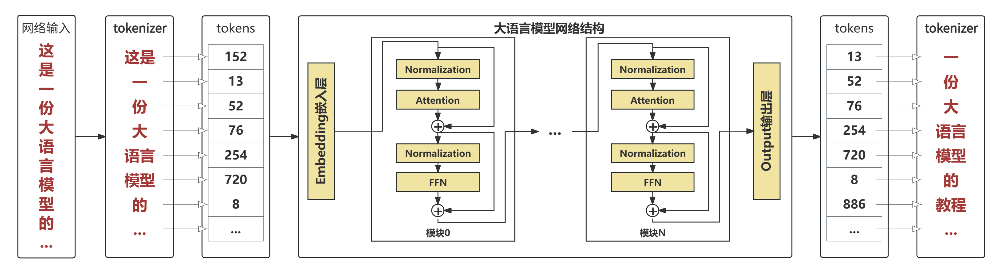
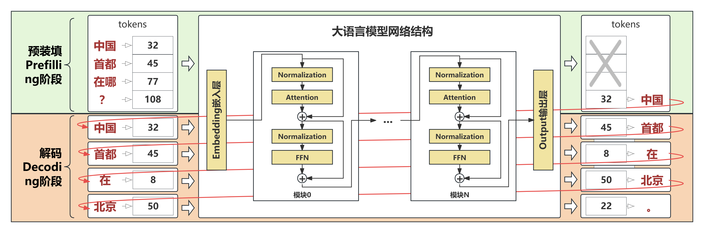

# 01 大语言模型结构概览

申明：本教程的所有内容(文字，图片，代码等)可以用于非盈利目的个人使用和分享。但如果用于盈利目的，包括但不限于卖课，公众号，视频号等需要经由作者的批准。谢谢理解。

[\[主目录链接\]](https://github.com/KaihuaTang/All-you-need-to-know-about-LLM)

**如果您认为本教程对您的学业或事业有所帮助，愿意给我打赏以赞助我后续的教程和开源项目，欢迎通过下列链接给予赞助。** 

[\[赞助\]](https://kaihuatang.github.io/donate.html)      [(赞助者列表)](https://kaihuatang.github.io/supporters.html)

## 前言
在具体深入了解每个网络模块之前，让我们先整体了解一下一个主流大语言模型的网络结构都有哪些组成部分。这里的主流结构主要是指的Qwen系列，LLaMA系列和DeepSeek系列等。最近比较火的国产DeepSeek大模型虽然对注意力模块(Attention)和前馈网络(FFN)的设计有调整，但整体架构依然符合我们图1所示的主流结构，在之后的章节中我也会把DeepSeek的改进作为拓展知识进行简单的介绍。在本系列中，为了不至于偏离主题陷入无止境背景知识罗列，我会最小化地收录实现大语言模型所需的知识，避免不必要的展开(展开太多我也不懂)。但同时我也会尽量保证知识的完备性，让大家不需要看的时候反复跳转出去搜索不理解的背景知识。下面我就从文本的输入到输出，端到端地讲解下主流大语言模型的整体架构。

## 一. 模型结构概览
<div align="center">
    
    图1：主流大语言模型输入到输出的流程图
</div>

上图是一个主流大语言模型(如[Qwen2](https://huggingface.co/docs/transformers/en/model_doc/qwen2),[LLaMA3](https://github.com/meta-llama/llama3),[DeepSeek-V3](https://github.com/deepseek-ai/DeepSeek-V3)等)从文本输入到文本输出的完整流程。可以看到其并不复杂。其中预处理和后处理使用的是名为tokenizer的文字编码解码模块，由于其并非神经网络，而是基于规则的传统分词器，因此我们把这部分的介绍放到网络结构后面。在开始阶段我们仅需知道tokenizer是一个给文本进行编号的模块，比如"你"=1，"好"=2，"世"=3，"界"=4。通常如果"你好"二字在数据集中经常同时出现，为了提升编码效率，我们会赋予"你好"一个独立的编号，例如"你好"=5。这样当"你好世界"出现时，我们优先将其编码为三位的[5,3,4]而非四位的[1,2,3,4]以此来提升编码效率，降低模型推理长度。我们通常描述里说的文本长度sequence length指的就是这里tokenizer编码后数字token序列的长度，而非字符串的长度，因此记录更多的词组用更少的token数量可以降低模型推理的次数，提升推理速度，但这也会增加tokenzier需要维护的字典长度，因为保存了更多的词组，这又导致网络Embedding嵌入层和output输出层的参数量增大。总的来说，tokenizer所维护的字典也不是越大越好，后续介绍tokenizer时我们会详细介绍。目前仅需知道tokenizer是文本到token序号的映射工具即可，通常一个token编号对应一个或多个的词组或字符。

同时tokenizer的字典一般也会增加一些特殊token，用作特殊事件的标记。比如定义一个token为起始符，每次对话开始时第一个token都用起始符开始，再比如定义结束符，因为大语言模型的生成不能喋喋不休，我们需要知道模型什么时候说完了，当模型输出结束符就标志着模型认为已经说完了。诸如此类需要标志某个事件的场景都可以定义特殊标记符。

除去tokenizer的编码和解码，上图的各个黄底小模块才是我们平时说的大语言模型的本体，也就是可学习的带参数神经网络模块。其中包含嵌入层(Embedding Layer)，若干Transformer模块，和输出层(Output Layer)。

### 1. 嵌入层(Embedding Layer)
我们可以将嵌入层理解为给tokenizer中每个token编号都学习了一个特征向量来表达该token所包含的信息。嵌入层(Embedding Layer)的输入是tokens，也就是一连串离散的数字编号(通常数据类型为LongTensor)，而其输出则是连续的浮点向量(通常为torch.float32, torch.float16或torch.bfloat16，具体类型取决于模型的精度)。嵌入层包含一个Weight权重，Weight的张量形状为(vocab_size, embedding_dim), 前者为tokenzier中字典的长度，后者为每个token在计算时的特征维度。

嵌入层的权重虽然也和线性层Linear一样叫Weight，但其的计算不同于正常的pytorch的线性层Linear，不是进行矩阵计算，而是直接将输入看作索引去提取Weight对应位置的特征向量，比如下面例子中，输入的[[1,3,5,7]]就是分别提取了Embedding权重的第1行，第3行，第5行，和第7行。每行是一个长度为embedding_dim的特征向量。

```
import torch
import torch.nn as nn

# Define the embedding layer
vocab_size = 30000  # Number of unique categories (e.g., vocabulary size)
embedding_dim = 1024    # Dimension of each embedding vector

embedding_layer = nn.Embedding(vocab_size, embedding_dim)

# Example input (batch of tokens)
batch_tokens = torch.tensor([[1, 3, 5, 7]])  # tensor shape [1, 4]

# Forward pass to obtain embeddings
output_embeddings = embedding_layer(batch_tokens) # tensor shape [1, 4, 1024]
```

### 2. Transformer模块
大语言模型网络在嵌入层和输出层之间会串联若干个Transformer模块作为网络的主体，通常情况下同一个网络的所有Transformer模块都是相同的结构，但也有一些尝试串联不同网络模块的探索，这里暂不展开。

每个Transformer模块内部由注意力模块(Attention)，前馈网络(Feed-Forward Network / Multi-Layer Perceptron)，归一化层(Normalization)组成。每个模块的输入和输出的张量数据形状都是[batch_size, sequence_length, embedding_dim]。其中通常包含两个残差连接(Residual Connection)，即类似x=x+f(x)的网络结构，也就是图1中每个模块在Normalization+Attention前后的残差连接和Normalization+FFN前后的残差连接。这里我们图1展示的结构为主流的[Qwen2](https://huggingface.co/docs/transformers/en/model_doc/qwen2)与[LLaMA3](https://github.com/meta-llama/llama3)，其主干上全是残差连接，两个残差连接之间不会有额外的模块，这通常被认为可以将网络训练的更深，当然Transformer模块内部也有不同于该主流形式的结构，我们会放到归一化层Normalization章节进行讲解。

作为大语言模型的主体，我们会将Transformer模块的各个子模块拆开在后续章节一一讲解，这里就不更进一步展开了，我们仅需将Transformer模块看作一个学习token与token之间联系并存储知识的神经网络模块即可。

### 3. 输出层(Output Layer)
经过若干层Transformer模块提取token之间的相关性和网络本身学到的知识，我们最终就会进入输出层。输出层本质就是一个线性层网络，其通用数学形式为 $y=xW^T+b$ 。而大语言模型的输出层一般会省略$b$来减少模型的偏见。输出层Weight的张量形状为(vocab_size, embedding_dim)，输入的张量形状为[batch_size, sequence_length, embedding_dim]，输出的张量形状为[batch_size, sequence_length, vocab_size]。

token在输出层的输出会用于预测其相邻的下一个token。具体的预测方式有贪婪预测和采样预测两种，其一的贪婪预测直接看作分类任务，取输出在最后一维的最大值的位置，即argmax计算，由于最后一维大小为vocab_size，所以刚好对应了tokenizer的词表，可以解码为对应的字符串。其二的的采样预测则需要将输出通过softmax归一化变成输出每个token的概率，然后基于其概率进行采样，采样策略有很多不同方案，比如top-k, top-p, temperature和其组合等，这里就不一一展开。

### 扩展知识：嵌入层输出层共享权重
这里扩展一个额外的知识点，由于嵌入层和输出层的本质都是用作将token从离散的编号空间和连续的特征空间之间进行映射，只是方向不同，但本质是做的同样的事情，因此理论上可以用同一套网络权重来做这事。即共享嵌入层和输出层的Weight。

这种共享权重的操作一般并不能提升网络的效果，但可以降低参数量，所以通常被用在较小的大语言模型上，比如[1B参数量的大语言模型](https://arxiv.org/pdf/2402.02791)等。因为vocab_size很大（通常有几万到十几万），嵌入层和输出层其实参数量其实并不小，将他们的权重共享，可以空出更多的参数用到Transformer模块上，节省可训练参数。但需要注意的是，其计算量并不会减少，因为嵌入层和输出层的输入输出和权重的形状都没有变，还是会分别计算的。

## 二. 大语言模型推理的两个阶段

<div align="center">
    
    图2：大语言模型推理的两个阶段: 预装填(Prefilling)阶段与解码(Decoding)阶段 
</div>

目前主流的大语言模型框架又被称为decoder-only架构(仅解码器架构)，也有是没有encoder只有decoder。那为什么又会说大语言模型的推理有预装填(Prefilling)与解码(Decoding)两个阶段呢？不应该只有decoding吗？

在回答上述疑问之前我们先说说什么样的Transformer网络可以被成为decoder解码器。顾名思义，decoder是用来产生输出的，对于文本生成这个任务来说，我们无法一次性穷举文本的所有可能性，比如当我们将tokenizer的字典集扩展到十几万时，可能最长的一个token也就四五个汉字，如果要用一个token表达一个完整的句子，可能需要兆亿的( $100000^N$ )字典集来穷举所有文字的可能组合，这显然是不合理的。因此我们将生成一个句子，拆成生成多个token的任务，每次仅生成一个token(2-3个汉字)，不停迭代直到输出完整的一句话。在这种结构里，生成的第一个token只能看到用户的输入，而生成的第二个token可以看到用户的输入加已经生成的第一个token，以此类推，越往后的token能看到输入越多（因为已经生成的token越多），这就天然地形成了一个叫causal attention因果注意力的结构，下章会详细展开。我们这里需要知道的是，因果注意力的特性就是后面的token可以看到前面的，前面的看不到后面的，例如第3个token计算的时候可以利用第1-3个token的信息，但不能利用第4个和往后的token的信息，因为这时候后面的token还没产生。这样的网络就是一个decoder transformer网络。

而大语言模型框架被称为decoder-only架构是因为不管是输入的问题还是输出的回答，都统一按照decoder的形式处理，即前面的token看不到后面的。所以大语言模型只有一种网络结构，也只有一套网络参数。不管是处理问题还是生成答案，数学上都是走的同一套网络的计算形式，也利用的是同一套网络参数。

### 预装填(Prefilling)阶段
虽然计算方式和计算参数相同，但问题和答案终究是有区别的，区别在于问题是一次性完整的丢给模型的，答案是需要一个一个生成的。即把问题丢给网络时，虽然我们处理第1个token时不会利用第2个token和往后token的信息，但其实我们已经知道第2个token了，而事实上第1个token的输出我们也并不会使用，不然如上图2所示，第1个token的输出很可能是“人民”，可问题中第2个token是“首都”，所以我们肯定是以输入的问题为准。在整个问题的token序列中，我们真正在意的也是会看作输出的其实只有问题的最后一个token的输出，因为它给出了答案的第一个token。

所以综上，预装填阶段除了最后一个token需要输出外，其他token的输出均可丢弃，因为输入问题的所有token已经知晓，无需模型预测。这带来的一个好处就是，我们可以一次性把整个问题丢进去，比如问题有N个token，预装填阶段就输入N个token，然后输出最后一个token的输出。

### 解码(Decoding)阶段
接着上面的例子，在解码阶段，数学上等价的计算其实是：第一次解码输入N+1个token（完整的问题+预测的一个token）然后取最后一个token 的输出，第二次解码输入N+2个token，然后继续取最后一个token 的输出，直到最后模型预测出了结束符，标志着回答结束。但这似乎就和预装填没什么区别了。这里就得提前说一个概念叫KV Cache的概念了，这个概念是大语言模型推理优化的一个核心概念，可以大大加速模型推理。我们会在介绍完注意力模块的章节之后完整地介绍KV Cache，这里仅需知道有了KV Cache之后，我们在解码阶段，网络每次仅需输入1个token在加上历史的KV Cache，就可以预测下一个token，而不需要重复计算完整的N+1个token。也因此让预装填和解码两个阶段有了不同的网络调用形式。但我们需要理解的是，归根结底，我们在预装填和解码两个阶段调用的都是同一个模型，因此数学上解码阶段是可以被等价改写成预装填的计算形式的。

课外思考：通过KV Cache这个名字，聪明的同学不知道能否想到其原理呢？我可以剧透的是，这是由于因果注意力结构，让前面的token不会随后面的token生成而更新，在这种情况下，不知道大家是否可以想到为什么有了KV Cache我们就可以仅需要1个token+前N个token的KV Cache就实现等同于输入N+1个token同时计算的效果了？以及这到底能节省多少计算？我会在后面的章节回答这个问题。

### 扩展知识: Encoder-Decoder 与 Prefill-Decode区别
在我个人的理解里Encoder-Decoder架构的本质在于不等价性，其输入和输出是走的两套网络，通常这意味这处理问题和生成答案的两个网络有不同的网络结构，比如问题用双向自注意力结构，答案用交叉注意力结构。或者即便是相同的网络参数，处理问题用双向注意力，处理答案用因果注意力[(如早期版ChatGLM)](https://github.com/THUDM/ChatGLM-6B)，我认为只要体现了数学上的不等价性这也都可以算是Encoder-Decoder架构。

而Prefill-Decode和Encoder-Decoder的本质区别我认为是在于Prefill-Decode的等价性。上面我们也说了，大语言模型的Prefill和Decode在计算上是等价的，Decode过程也可以数学上写成或代码上实现成Prefill的形式，只是因为Decode阶段用KV Cache做加速更高效，所以才让他们看似走了不同的计算流程。

---------

[\[主目录链接\]](https://github.com/KaihuaTang/All-you-need-to-know-about-LLM)

## 引用链接

```
@misc{tang2025all,
title = {All you need to know about LLM: a LLM tutorial},
author = {Tang, Kaihua},
year = {2025},
note = {\url{https://github.com/KaihuaTang/All-you-need-to-know-about-LLM}},
}
```
