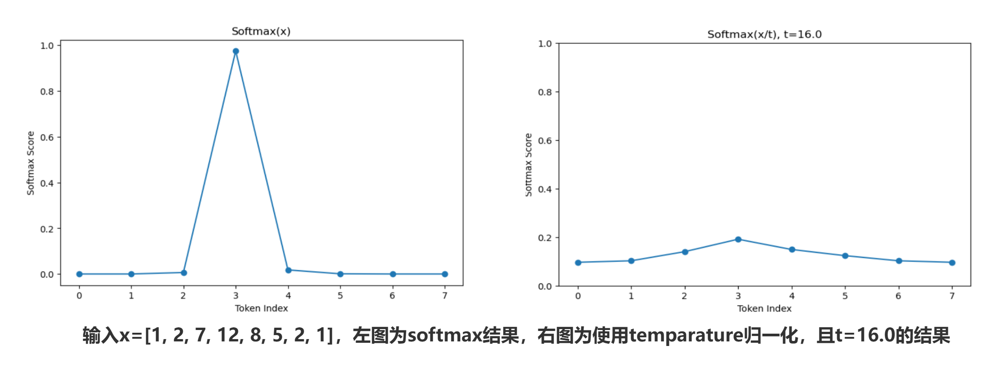
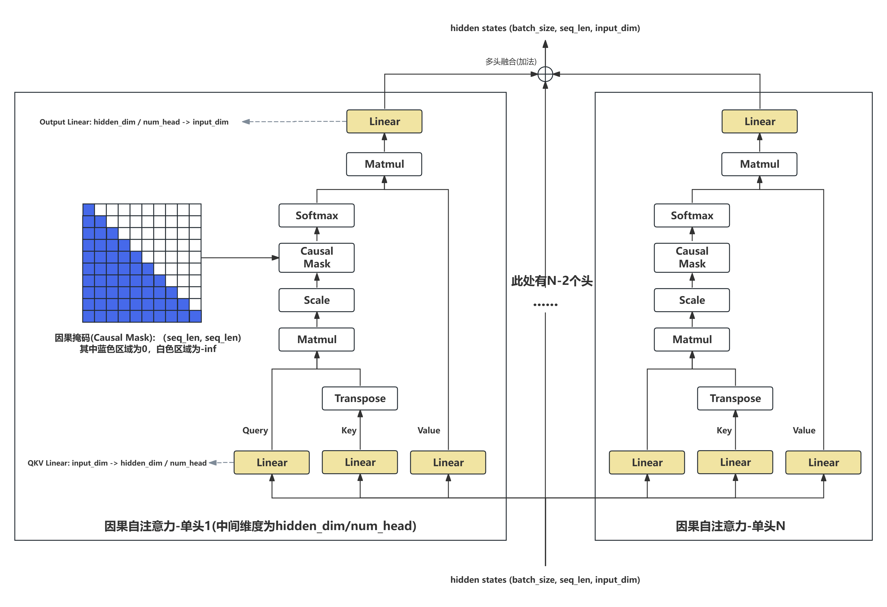

# 02 注意力模块与KV Cache

申明：本教程的所有内容(文字，图片，代码等)可以用于非盈利目的个人使用和分享。但如果用于盈利目的，包括但不限于卖课，公众号，视频号等需要经由作者的批准。谢谢理解。[\[知乎链接\]](https://zhuanlan.zhihu.com/p/19275166926)

[\[主目录链接\]](https://github.com/KaihuaTang/All-you-need-to-know-about-LLM#章节链接)


## 前言
作为大语言模型中核心的核心，我将注意力模块排在了其他模块之前放在最前面讲解。我们在本章里会从其原理，结构，各种优化版本讲到目前主流开源大语言模型的具体代码(Qwen2/LLaMA3, DeepSeek-V3)。但本章节仅限于对注意力结构本身原理的阐述，并不会太涉及优化，比如目前主流的[FlashAttention-v1/v2/v3](https://github.com/Dao-AILab/flash-attention)或者一些[线性注意力架构](https://arxiv.org/abs/2401.04658)，这些要么就是基于硬件做的数学等价优化，要么就是完全改变了传统注意力计算形式尚没有被主流认可。不过我相信只要理解了注意力结构的基本原理，后续优化相关工作也很容易入门了

## 一. 注意力原理
和传统的卷积网络(CNN)或者多层感知器(MLP)直接对输入特征做映射不同，要想理解注意力模块的运行原理，我们不能将其看作对输入的单纯映射，即y=f(x)。一次最基本的注意力计算，需要三个输入QKV：Query，Key，Value。其中Query表示当前想要检索或关注的信息，可以理解为模型“要解决的问题”或“要检索的关键词”。Key表示已知信息的索引或标识，用于和 Query 进行匹配，看看是否匹配。而每个Value都和一个Key一一对应，表示其指代的具体的内容或信息，当 Key 与 Query 匹配时，就会将这个Key对应的Value 视为“回答”或“检索出的信息”。注意，虽然Key和Value必须一一对应，但Query则可以有任意的数量。

我们可以通过下面例子理解注意力模块的计算方式：假设我们需要查询班上同学的身高。我们对班上的四个同学小明，小凯，小丽，小花先构建他们对应的Key和Value信息字典。其中每个Key指代一个同学，Value则是其对应的身高。而Query则是一个个具体需要解决的问题。比如我们想要知道小明的身高，则Query1就是小明。我们还想知道班上女生的身高(平均身高)，Query2就是女生。而Query和Key之间的匹配程度就是注意力图，也叫Attention Map，一般注意力图会在数值上利用softmax非线性函数上进行归一化，保证每一行和为1。然后再利用注意力图作为权重从Value中提取对应的加权信息，最后得到小明的身高175 x 1=175cm和班上女生的平均身高166 x 0.5 + 170 x 0.5 = 168cm。

<div align="center">
    
    图1：注意力原理示意图 
</div>

因此，不同于单纯的映射。注意力模块还能计算信息之间的交互，这赋予了模型更大的表达能力和推理能力，让模型在处理文本、图像等复杂数据时，能够依据不同的任务“关注”到对应的重要信息，大大提升了处理效率和准确度。

## 二. 自注意力结构(Self-Attention)

### 1. 基础自注意力结构
广义的注意力结构仅仅要求K(Key)和V(Value)有同一输入序列来源，Q(Query)则可以来自其他序列。而QKV均来自于同一输入序列，且三者全部一一一对应的就是自注意力结构(Self-Attention)。注意当QKV均来自于同一输入序列时，他们的区别仅仅就是通过了不同的线性层，即Q=Linear(X), K=Linear(X), V=Linear(X)，三个线性层权重独立。因此最简单的自注意力结构可以通过如下代码实现：

```
import torch
import torch.nn as nn
import math

class SelfAttention(nn.Module):
    def __init__(self, input_dim, hidden_dim):
        """
        简易自注意力层
        :param input_dim: 输入维度
        :param hidden_dim: 隐藏层维度
        """
        super(SelfAttention, self).__init__()

        # 定义线性层，用于生成 Q、K、V
        self.query = nn.Linear(input_dim, hidden_dim)
        self.key   = nn.Linear(input_dim, hidden_dim)
        self.value = nn.Linear(input_dim, hidden_dim)

        # 输出变换
        self.out = nn.Linear(hidden_dim, input_dim)

    def forward(self, x):
        """
        :param x: 输入张量，形状 [batch_size, seq_len, hidden_dim]
        :output: 自注意力计算后的输出，形状 [batch_size, seq_len, hidden_dim]
        """
        batch_size, seq_len, hidden_dim = x.shape

        # 线性变换得到 Q, K, V
        # 形状: [batch_size, seq_len, hidden_dim]
        Q = self.query(x)
        K = self.key(x)
        V = self.value(x)

        # 计算注意力分数: Q @ K^T / sqrt(hidden_dim)
        # Q: [batch_size, seq_len, hidden_dim]
        # K^T: [batch_size, hidden_dim, seq_len]
        # scores: [batch_size, seq_len, seq_len]
        scores = torch.matmul(Q, K.transpose(-2, -1)) / math.sqrt(hidden_dim)

        # 通过 softmax 得到注意力分布
        attn_weights = torch.softmax(scores, dim=-1)

        # 注意力加权 V
        # [batch_size, seq_len, seq_len] x [batch_size, seq_len, hidden_dim]
        # => [batch_size, seq_len, hidden_dim]
        attn_output = torch.matmul(attn_weights, V)

        # 输出层
        output = self.out(attn_output)

        return output

if __name__ == "__main__":
    # 测试代码
    batch_size = 2
    seq_len = 5
    input_dim = 256
    hidden_dim = 256
    x = torch.randn(batch_size, seq_len, input_dim)

    attention = SelfAttention(input_dim, hidden_dim)
    out = attention(x)
    print("输入形状:", x.shape)
    print("输出形状:", out.shape)
```

上述代码仅需一个输入序列x即可完成注意力的计算。通过三个线性层得到Q,K,V后，我们会计算注意力分数，也就是Q和K^T的矩阵乘，注意这里torch.matmul(Q, K.transpose(-2, -1))还需除以一个系数math.sqrt(hidden_dim)，这么做的原因我认为有两个：1）一个是为了归一化，随着hidden_dim的维度增加，注意力分数很容易出现极大值，这在后续的softmax计算中很容易出现数值溢出，因为softmax中会有exp计算，会进一步放大极大值，导致梯度消失或者梯度爆炸让训练极不稳定；2）这涉及到softmax非线性函数中引入temperature的概念，通过增加参数t，softmax(x/t)可以控制输出的分布，当t=math.sqrt(hidden_dim)时，本质是防止softmax后的分布过于“尖锐”（即一个位置可能占据了绝大部分注意力），模型在训练初期就过早地偏向了某些token可能会导致对大多数token训练不足，影响模型训练效果。如下图2所示，当hidden_dim=256时，math.sqrt(hidden_dim)=16.0，同一组输入[1, 2, 7, 12, 8, 5, 2, 1]在添加归一化系数t=16.0和不添加的情况下softmax结果差异巨大，不归一化的话大部分位置的注意力权重都几乎为0，只能学到值为12的位置。添加归一化后大部分位置的注意力分数在0.1-0.2的区间，都能学到。

<div align="center">
    
    图2：softmax前添加temperature归一化系数与不添加的区别。
</div>

获得注意力分数后，我们还需要进行softmax归一化，softmax的公式如下。softmax归一化主要是为了保证每一个Query对所有Key的分数的总和为1.0，这样当我们将注意力分数作为加权系数乘Value求和后输出的向量整体分布稳定。如图1的例子，如果不做归一化，Query2女生与Key3小丽(女)和Key3小花(女)均匹配成功（即系数为1），那女生的平均身高就变成了166 x 1.0 + 170 x 1.0 = 336cm。如果说把匹配成功的分数改成0.5不就行了，这样的话Query1小明的身高不就是175 x 0.5 = 87.5cm了，所以还是需要归一化来决定什么时候系数时1.0，什么时候是0.5，这就是引入softmax非线性层的原因。

 $ softmax(Z)_i = \frac{e^{z_i}}{\sum_{k=i}^n e^{z_k}}, Z=(z_0, z_1, ..., z_n) $ 

而后归一化的注意力权重attn_weights就会乘以value得到注意力计算的输出。我们一般还会再添加一层线性层(Output Projection)，作为注意力模块的最终输出。线性层主要就是增加模型的表达能力并且存储知识，这就没什么可以解释的了。

### 2. 多头因果自注意力结构(Multi-Head Causal Self-Attention)
但这还远不能算作自注意力结构的完整形态，在实际大语言模型的注意力结构中，我们还需引入两个重要的改动：多头注意力(multi-head attention)与因果掩码(causal mask)。其中关于多头注意力，如果说我们平时堆叠网络的模块数是增加网络的深度(串联)，那么多头注意力其实就是增加网络的广度(并联)，一个8头的注意力层相当于并联了8个独立权重的注意力层。因果掩码则和下面要说的KV Cache缓存机制息息相关，因果掩码不仅确保了输入问题和答案生成的注意计算形式完全一致，还让生成答案时可以大幅降低计算量。

<div align="center">
    
    图3：多头因果自注意力结构原理图。
</div>

如上图所示，首先多头因果自注意力结构在计算softmax前会加上一个掩码，该掩码白色部分为-inf，这样计算softmax时，-inf对应位置的输出就为0，因为exp(-inf)=0。这样可以保证第K个Query提取信息时，仅能访问第0-K个Key和Value，无法获取第K往后的Token的信息。这也就是因果注意力中“因果(Causal)”的由来，无法提取未来Token的信息。

而我图中多头注意力的呈现方式与大多数Transformer论文的配图略有不同，我认为这样更便于理解，而且数学上也完全是等价的。我们完全把Attention分成了独立的N份，每份的中间为度从hidden_dim降到了hidden_dim / N，这里的N就是头数(num_head)，这样保证了模型参数量不变的情况下，模型变成独立参数的N份，这样就实现Ensemble，Ensemble是神经网络中一种常见的提升模型能力的方式，或者说奇技淫巧(trick)，相当于三个臭皮匠胜过诸葛亮，三个独立的小模型的结果求平均会比一个大模型更好。因为这可以防止一个模型不小心陷入局部次优解。而在注意力中，多头还引入了一个新的意义，就是不同的头可以独立的关注到不同区域，也就是每个头softmax后的注意力图都不一样，增加了模型的学习和表达能力。

注意：多头注意力的实现并不需要真的维护N个子网络，而是通过reshape将hidden_dim维度拆分成两个维度num_head和head_dim维度即可，而且最终先concate再过一个大的输出线性层和过N个小的输出线性层再求和在数学上也是等价的。具体实现代码如下：

```
class MultiHeadCausalSelfAttention(nn.Module):
    def __init__(self, input_dim, hidden_dim, num_heads=8):
        """
        简易自注意力层
        :param input_dim: 输入维度
        :param hidden_dim: 隐藏层维度
        :param num_heads: 多头注意力的头数，这里可以指定为8表示单头注意力
        """
        super(MultiHeadCausalSelfAttention, self).__init__()
        self.input_dim = input_dim
        self.hidden_dim = hidden_dim
        self.num_heads = num_heads
        # 将嵌入维度平分到各个头上
        # 注意实际应用中需要确保 embed_dim % num_heads == 0
        self.head_dim = hidden_dim // num_heads

        # 定义线性层，用于生成 Q、K、V
        self.query = nn.Linear(input_dim, hidden_dim)
        self.key   = nn.Linear(input_dim, hidden_dim)
        self.value = nn.Linear(input_dim, hidden_dim)

        # 输出变换
        self.out = nn.Linear(hidden_dim, input_dim)

    def forward(self, x, mask=None):
        """
        :param x: 输入张量，形状 [batch_size, seq_len, input_dim]
        :param mask: 可选的掩码（mask），形状与注意力矩阵匹配，如 [batch_size, 1, seq_len, seq_len]
        :return: 自注意力计算后的输出，形状 [batch_size, seq_len, input_dim]
        """
        batch_size, seq_len, input_dim = x.shape

        # 线性变换得到 Q, K, V
        # 形状: [batch_size, seq_len, input_dim]
        Q = self.query(x)
        K = self.key(x)
        V = self.value(x)

        # 多头展开
        # 变换后形状: [batch_size, seq_len, num_heads, head_dim]
        Q = Q.view(batch_size, seq_len, self.num_heads, self.head_dim)
        K = K.view(batch_size, seq_len, self.num_heads, self.head_dim)
        V = V.view(batch_size, seq_len, self.num_heads, self.head_dim)

        # 将 [batch_size, seq_len, num_heads, head_dim] 转成 [batch_size, num_heads, seq_len, head_dim]
        Q = Q.permute(0, 2, 1, 3)  # [batch_size, num_heads, seq_len, head_dim]
        K = K.permute(0, 2, 1, 3)
        V = V.permute(0, 2, 1, 3)

        # 计算注意力分数: Q @ K^T / sqrt(head_dim)
        # Q: [batch_size, num_heads, seq_len, head_dim]
        # K^T: [batch_size, num_heads, head_dim, seq_len]
        # scores: [batch_size, num_heads, seq_len, seq_len]
        scores = torch.matmul(Q, K.transpose(-2, -1)) / math.sqrt(self.head_dim)

        # 如果有 mask，则在计算分数时将被mask的部分赋予一个很大的负数，以避免注意力
        # mask 形状一般为 [batch_size, 1, seq_len, seq_len] 或 [batch_size, num_heads, seq_len, seq_len]
        if mask is not None:
            scores = scores + mask

        # 通过 softmax 得到注意力分布
        attn_weights = torch.softmax(scores, dim=-1)
        print("注意力权重分布:", attn_weights)

        # 注意力加权 V
        # [batch_size, num_heads, seq_len, seq_len] x [batch_size, num_heads, seq_len, head_dim]
        # => [batch_size, num_heads, seq_len, head_dim]
        attn_output = torch.matmul(attn_weights, V)

        # 把多头重新拼接回原始形状
        # [batch_size, num_heads, seq_len, head_dim] -> [batch_size, seq_len, num_heads, head_dim]
        attn_output = attn_output.permute(0, 2, 1, 3).contiguous()
        # 拼接头部维度
        # => [batch_size, seq_len, input_dim]
        attn_output = attn_output.view(batch_size, seq_len, input_dim)

        # 输出层
        output = self.out(attn_output)

        return output

if __name__ == "__main__":
    # 测试代码
    batch_size = 1
    seq_len = 5
    input_dim = 256
    hidden_dim = 256
    num_heads = 2
    x = torch.randn(batch_size, seq_len, input_dim)
    causal_mask = torch.triu(torch.ones(5, 5, device=x.device, dtype=torch.float),
                            diagonal=1
                        )
    causal_mask = causal_mask.masked_fill(causal_mask == 1, float('-inf'))
    
    attention = MultiHeadCausalSelfAttention(input_dim, hidden_dim, num_heads=num_heads)
    out = attention(x, mask=causal_mask)
    print("输入形状:", x.shape)
    print("输出形状:", out.shape)
```

## 三. KV Cache缓存机制
假设我们有两个token在某一层的输入特征(hidden states): $[x_1, x_2]$, 经过三个线性层，我们得到他们分别的QKV: $[q_1, q_2], [k_1, k_2], [v_1, v_2]$, Attention后对应的输出为： $[y_1, y_2]$ 。在因果掩码(Causal Mask)下，Attention的计算公式应该如下，其中OutLinear只是对输出做映射的线性层：

$y_1 = OutLinear( softmax(q_1 @ [k_1]^T) @ [v_1] )$

$y_2 = OutLinear( softmax(q_2 @ [k_1,k_2]^T) @ [v_1,v_2] )$

由于因果掩码让每个token的query只能看到其自己和其前面的token的key-value，当我们计算完这个两个token要去推理第三个token的时候，计算公式如下：

$y_1 = OutLinear( softmax(q_1 @ [k_1]^T) @ [v_1] )$

$y_2 = OutLinear( softmax(q_2 @ [k_1,k_2]^T) @ [v_1,v_2] )$

$y_3 = OutLinear( softmax(q_3 @ [k_1,k_2, k_3]^T) @ [v_1,v_2,v_3] )$

这时候我们会发现，当推理第三个token时，前两个token的计算完全没有变，也就是说 $[y_1, y_2]$ 的结果和推理第二个token时一摸一样。也许有人要说大模型除了注意力还有前馈网络FFN呀，注意，FFN的计算中每个token都是独立的，不会相互影响，只要attention的输出结果一样，后续FFN的输出结果必然一样。这时候我们就会发现，一旦有了因果掩码，当推理第N个token的时候，再去计算前0到N-1个token就完全是浪费了，因为计算结果完全一样。我们再看如果推理第N个token的时候只计算 $x_N$ 本身，他的 $q_N,k_N,v_N$ 都可以直接通过 $x_N$ 过线性层得到，其需要额外进入的就只有 $[k_1,k_2,...,k_{N-1}],[v_1,v_2,...,v_{N-1}]$ 。而这些Key和Value完全没必要重走一边线性层的计算，因为推理第N-1个token的时候已经得到过一次了，所以当时只要存下来这是再读取拿来用就好了，这也就是KV Cache，用存储和加载的带宽增加换计算节省的一种优化方式。

### 扩展知识1：为什么生成式语言模型一定要因果注意力（causal attention）？

如果没有因果掩码，如下面公式所示，一旦推理到第3个token的时候，第1和第2个token可以看到后面的token，那么 $[y_1,y_2,y_3]$ 三个值都会更新，这时候就需要重算所有的token了。以此类推，推理到第N个token的时候，前N-1个token还得全部输入重新计算attention。这就没法用KV Cache了，因为一旦attention的输出改变了，前N-1个token的FFN也需要重新计算。

$y_1 = OutLinear( softmax(q_1 @ [k_1,k_2, k_3]^T) @ [v_1,v_2,v_3] )$

$y_2 = OutLinear( softmax(q_2 @ [k_1,k_2, k_3]^T) @ [v_1,v_2,v_3] )$

$y_3 = OutLinear( softmax(q_3 @ [k_1,k_2, k_3]^T) @ [v_1,v_2,v_3] )$

所以说因果掩码不仅仅是能让模型的推理过程更符合人类接受和输出信息的时序性。我认为其最大的价值是，引入了KV-Cache这个优化方案。这是只有在因果掩码注意力下才可以使用的。

### 扩展知识2：KV-Cache的优化能省下多少计算力？

我们来估算下计算复杂度，我们假设特征的维度d是常数，仅考虑推理token数N的变化，那么注意力的计算复杂度其实就是来自于QKV计算中的两个矩阵乘，也就是 $O(N^2)$ ，因为线性层的复杂度此时只有 $O(N)$ 。而一旦引入了KV Cache，我们QKV的计算复杂度是要输入一个query，所以复杂度就缩减到了 $O(N)$ 。一个KV-Cache就可以将计算复杂度从$O(N^2)$降低到$O(N)$还能保证数学等价性，简直血赚。

### 扩展知识3：如何简单有效地加速首轮(Prefilling)问答响应时间？

首轮Prefilling回答速度之所以会慢，是因为首轮需要一次性把问题的prompt全部输入，同时推理所有token还是 $O(N^2)$ 的复杂度，后续增量decoding每次只要推理一个token就快很多只要 $O(N)$ 的复杂度。

优化首轮回答响应速度是工业界一个非常重要的研究课题，尤其是超长文本输入的时候，比如把整个几十万字的一本书全部作为输入来询问关于这本书的问题时。我这里提供一个简单的思路，也是我2023年末参加中国移动全球合作伙伴大会演示时想到的一个非常简单的技巧，就是把系统prompt提前计算好存成KV-Cache。因为大模型使用时除了问题本身，我们往往还会增加一个固定的系统prompt在问题前面，这部分的token是不会变的，所以我们完全可以提前离线计算好。这个小技巧让我们当时首轮平均响应速度从7秒降低到了3-4秒（具体提升比例受实际问题长短影响）。所以说KV-Cache真是个妙不可言的好东西。我2023年第一次理解了KV-Cache的原理时，深深的感受到了什么叫工程的美感，人类智慧的结晶。

### 扩展知识4：pytorch的动态长度推理怎么转换为需要静态张量形状的ONNX推理格式？

我们2023年部署端侧大语言模型参展时另外遇到的一个问题就是动态转静态的问题。我们当时的安卓部署平台仅仅支持老版本的ONNX(一种工业界AI模型的存储格式，包含了模型结构与权重，可以直接拿去运行推理)，不支持动态轴，因为我们项目周期只有不足4个月，我们没有时间和人力去修改部署平台底层，因此我想到了一个取巧的办法，通过一定的冗余来将动态推理转换为静态。

首先ONNX的静态推理意味着，模型的所有计算都必须有固定的张量形状(tensor shape)，可在大语言模型的推理中token数的N是变化的呀，因此我只能将token数的维度固定为2048，永远计算2048个token。好在有KV-Cache，计算复杂度只是线性提升，不是平方提升。然后实际推理第k个token的时候 $(k < N)$ ，把k+1到N个token的注意力部分给mask掉，也就是赋予-inf的值，让其softmax后为0，防止其参与计算。

这个部署策略我们后来也看到其他公司和其他人使用过，但我觉得这毕竟是无奈之举，会有计算浪费，还希望各个公司早日把推理库的底层改成支持动态轴(有一些张量维度的长度可以变)，2025年了，别再拖着了。

-------------

注意力模块相关的内容确实比较多，我决定把注意力模型的优化单开一章节，尤其是着重讲一下最近特别火的DeepSeek开源模块对注意力模块的修改。

[\[主目录链接\]](https://github.com/KaihuaTang/All-you-need-to-know-about-LLM#章节链接)


## 引用链接

```
@misc{tang2025all,
title = {Building a Small LLM from Scratch: a tutorial},
author = {Tang, Kaihua and Zhang, Huaizheng},
year = {2025},
note = {\url{https://github.com/KaihuaTang/Building-a-Small-LLM-from-Scratch}},
}
```