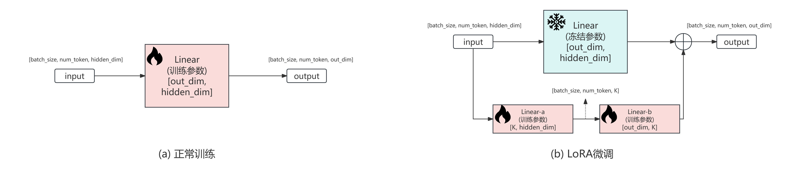
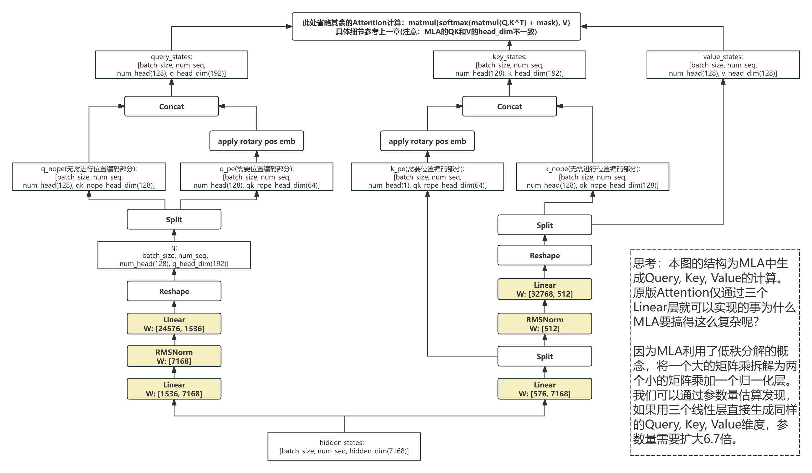

# 03 DeepSeekV3的注意力优化

申明：本教程的所有内容(文字，图片，代码等)可以用于非盈利目的个人使用和分享。但如果用于盈利目的，包括但不限于卖课，公众号，视频号等需要经由作者的批准。谢谢理解。[\[知乎链接\]](https://zhuanlan.zhihu.com/p/19275166926)

[\[主目录链接\]](https://github.com/KaihuaTang/All-you-need-to-know-about-LLM#章节链接)


## 前言
书接上文[注意力模块与KV Cache](chapter2/README.md)，介绍完了基本的大语言模型的注意力模块与相关的KV-Cache，我们本章着重展开讲讲主流开源大模型注意力模块的后续改良与优化。本章我们不仅会介绍最近当红的[DeepSeek-V3](https://github.com/deepseek-ai/DeepSeek-V3)注意力优化原理，更会直接深扒一下Qwen2/LLaMA3和DeepSeekV3具体的注意力模块的代码，深入讲解每一行代码对应的功能和原理。(DeepSeek太火了，被拉回国项目攻关了，更新耽误了两周)

## 一. 注意力优化
主流的开源大模型网络的注意力计算机制除了上一章介绍的多头注意力Multi-Head Attention(MHA)以外，最近也有了新的变种，主要包括Multi-Query Attention (MQA)，Grouped-Query Attention (GQA)和最近当红的DeepSeek的Multi-head Latent Attention (MLA)而他们优化的方向其实是一致的，就是极致的压缩KV的大小，因为这样KV-Cache可以加载的更快。毕竟现在都在说超长上下文，token数N长了KV-Cache优化后加载KV的传输带宽开销可也不小啊。

<div align="center">
    
    图1：各种注意力优化方案。
</div>

### 1. Multi-Query Attention (MQA) / 多查询注意力

参考上一章的标准多头注意力Multi-Head Attention(MHA)的代码，其QKV构成如下：
```
# x为attention模块输入的所有token的hidden states
batch_size, seq_len, input_dim = x.shape

# 线性变换得到 Q, K, V
Q = self.query(x)    
K = self.key(x)
V = self.value(x)

# 多头展开
# 变换后形状: [batch_size, seq_len, num_heads, head_dim]
Q = Q.view(batch_size, seq_len, self.num_heads, self.head_dim)
K = K.view(batch_size, seq_len, self.num_heads, self.head_dim)
V = V.view(batch_size, seq_len, self.num_heads, self.head_dim)

# 此处省略后续attention计算
```
其中K和V对应的线性层self.key和self.value都必须将token的特征从input_dim维度映射到num_heads * head_dim维度。也就是说这两层的线性层权重的张量形状为[num_heads * head_dim, input_dim]。而同时KV Cache也必须存储两个[batch_size, seq_len, num_heads, head_dim]大小的张量。

而多查询注意力Multi-Query Attention (MQA)做的优化直白来来讲就是只对Query做多头注意力，而Key和Query只生成单头。此时self.key和self.value线性层权重的张量形状为[head_dim, input_dim]，这不仅让线性层计算量缩小num_head倍，KV Cache的大小也缩小了同样的倍数，计算量和带宽双收益。当然天下没有免费的午餐，由于Key和Value仅有一个头，其表达能力肯定是有所损失的。具体MQA参考代码如下：

```
# x为attention模块输入的所有token的hidden states
batch_size, seq_len, input_dim = x.shape

# 线性变换得到 Q, K, V
Q = self.query(x)
K = self.key(x)        # 注意此处的key线性层输出维度小于MHA
V = self.value(x)      # 注意此处的key线性层输出维度小于MHA

# 多头展开
Q = Q.view(batch_size, seq_len, self.num_heads, self.head_dim)
K = K.view(batch_size, seq_len, 1, self.head_dim)
V = V.view(batch_size, seq_len, 1, self.head_dim)

# 将K和V复制若干份，扩展至: [batch_size, seq_len, num_heads, head_dim]
K = K.repeat(1, 1, self.num_heads, 1)
V = V.repeat(1, 1, self.num_heads, 1)

# 此处省略后续attention计算
```


### 2. Grouped-Query Attention (GQA) / 组查询注意力

正如上文说的，MQA必然带来注意力层表达能力的下降。因此就有了组查询注意力Grouped-Query Attention (GQA)，这其实是MHA和MQA的折中，就是Query保留所有head数的情况下，Key和Value不止一个头，而是保留num_group数的头(num_groups <= num_heads且num_heads可以被num_groups整除)，我们不难发现GQA是MHA和MQA的一种泛化形式，num_groups=1时就是MQA，num_groups=num_heads时就是MHA。可以说是万金油的表达形式。因为GQA是更泛化的表达形式，同时也有个额外的参数num_groups（有的代码中也叫num_key_value_heads）可以调，因此GQA往往可以调到与MHA差不多的性能，同时又能有KV Cache和线性层计算减少的收益。在主流的Qwen2和LLaMA3的代码中，一般也都支持GQA的配置。

具体GQA参考代码如下：
```
# x为attention模块输入的所有token的hidden states
batch_size, seq_len, input_dim = x.shape

# 线性变换得到 Q, K, V
Q = self.query(x)
K = self.key(x)        
V = self.value(x)      

# 多头展开
# num_groups <= num_heads且num_heads可以被num_groups整除
Q = Q.view(batch_size, seq_len, self.num_heads, self.head_dim)
K = K.view(batch_size, seq_len, 1, self.num_groups, self.head_dim)   
V = V.view(batch_size, seq_len, 1, self.num_groups, self.head_dim)

# 将K和V复制若干份，扩展至: [batch_size, seq_len, num_heads, head_dim]
K = K.repeat(1, 1, self.num_heads // self.num_groups, 1, 1).view(batch_size, seq_len, self.num_heads, self.head_dim)
V = V.repeat(1, 1, self.num_heads // self.num_groups, 1, 1).view(batch_size, seq_len, self.num_heads, self.head_dim)

# 此处省略后续attention计算
```

### 3. Multi-head Latent Attention (MLA) / 多头潜在注意力

最近大火的[DeepSeek系列(从V2到V3)](https://github.com/deepseek-ai/DeepSeek-V3/tree/main)则采用了一种比GQA更极致的压缩方式，不仅进一步减少了注意力层中线性层的理论算力，更把KV Cache压缩到了新的境界。在介绍MLA之前，先介绍一个低秩分解在大模型上应用的例子，后面我们可能也会单独详细讲讲，就是[LoRA: Low-Rank Adaptation](https://arxiv.org/abs/2106.09685)。这是大模型常用的一种高性能微调方法，其具体概念就是，如果线性层的权重$W$太大(假设其张量形状为[out_dim, in_dim])，训练这个权重太耗显存了，我们可以训练两个更小的权重$W_a$和$W_b$(形状分别为[K, in_dim]和[out_dim, K]，K << in_dim, K << out_dim)。由于K远远小于in_dim和out_dim，这两个权重加起来也远远小于原始的$W$。参考概念如下图2。

<div align="center">
    
    图2：LoRA微调概念图。
</div>

当我第一次看到DeepSeek的多头潜在注意力Multi-head Latent Attention (MLA)，我首先映入脑袋的便是LoRA，区别是在MLA中并不是额外学两个小的线性权重，而是用直接用两个小的线性权重取代一个完整的线性层。具体MLA的网络结构如下图3（注意MLA在DeepSeek中有两种形式，一种是只有KV的线性层运用了低秩分解，一种是Q和KV都利用了低秩分解，后者也是最近大火的[DeepSeek-V3](https://github.com/deepseek-ai/DeepSeek-V3/tree/main)和[DeepSeek-R1](https://github.com/deepseek-ai/DeepSeek-R1/tree/main)的网络结构，因此我们这里以后者为例）。

<div align="center">
    
    图3：多头潜在注意力结构，参数规模参考DeepSeek-V3与R1。
</div>

上图是MLA如何生成Query，Key和Value的流程图。MLA结构中Query和Key都分为nope部分和rope部分，前者是指No Position Embedding即无需位置编码，后者指Rotary Position Embedding即需要旋转位置编码，而旋转位置编码则是图上apply rotary pos embed模块，该模块主要为了给token提供其在序列中与其他token的相对位置信息，下一章我们会展开详细讲解。

我们可以发现，原始的注意力仅需简单的三个Linear加上Reshape就可以生成Query，Key和Value，但MLA似乎让网络变得更复杂了。这是为什么呢？因为MLA利用了低秩分解的概念，将一个大的矩阵乘拆解为两个小的矩阵乘加一个归一化层。我们可以通过参数量估算发现，如果用三个线性层直接生成同样的Query, Key, Value维度，参数量需要扩大6.7倍。

除了参数量的降低，MLA更可以大幅降低KV Cache，如上图DeepSeek-V3与R1网络中，其每个token仅需保留64维的k_pe + 右侧RMSNorm后的512维特征，总计576维每token的Cache即可。因为其余的k_nope和Value都可以直接通过512维的特征再经过一个线性层得到。而此前其他大语言模型每个token需要多少维度的特征呢？以[72B的Qwen2.5](https://huggingface.co/Qwen/Qwen2.5-72B-Instruct/tree/main)模型为例，即便已经使用了组查询注意力GQA，每个token依然需要2048维(128 x 8 x 2)。DeepSeek的MLA将KV Cache压缩了3.5倍，当然这里存的已经不是标准的Key和Value了，需要引入额外的线性层计算才能转换为Key和Value，这就涉及到更复杂的算力和带宽的权衡了。


## 二. 大语言模型中的注意力
下面，让我们切切实实的看一看真实的大模型网络结构里注意力都长什么样。下面我会拿Qwen2/LLaMA3（这两个网络的注意力部分非常相似，因此我仅展示一个）与DeepSeekV3的实际代码进行演示。我会尽可能保留原始代码，仅出于可读性做一些修改，然后通过详细的注释来阐释每一块的作用。

### 1. Qwen2/LLaMA3的注意力代码详解

### 2. DeepSeekV3的注意力代码详解


-------------

[\[主目录链接\]](https://github.com/KaihuaTang/All-you-need-to-know-about-LLM#章节链接)


## 引用链接

```
@misc{tang2025all,
title = {Building a Small LLM from Scratch: a tutorial},
author = {Tang, Kaihua and Zhang, Huaizheng},
year = {2025},
note = {\url{https://github.com/KaihuaTang/Building-a-Small-LLM-from-Scratch}},
}
```