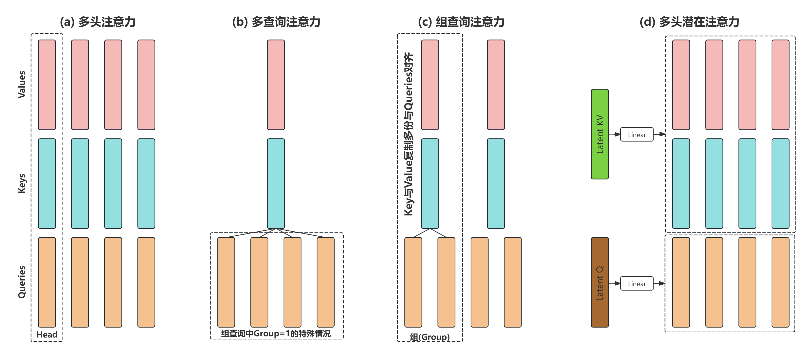

# 03 DeepSeekV3的注意力优化

申明：本教程的所有内容(文字，图片，代码等)可以用于非盈利目的个人使用和分享。但如果用于盈利目的，包括但不限于卖课，公众号，视频号等需要经由作者的批准。谢谢理解。[\[知乎链接\]](https://zhuanlan.zhihu.com/p/19275166926)

[\[主目录链接\]](https://github.com/KaihuaTang/All-you-need-to-know-about-LLM#章节链接)

**如果您认为本教程对您的学业或事业有所帮助，愿意给我打赏以赞助我后续的教程和开源项目，欢迎通过下列链接给予赞助。** [\[赞助\]](https://kaihuatang.github.io/donate.html)      [(赞助者列表)](https://kaihuatang.github.io/supporters.html)

## 前言
书接上文[注意力模块与KV Cache](chapter2/README.md)，介绍完了基本的大语言模型的注意力模块与相关的KV-Cache，我们本章着重展开讲讲主流开源大模型注意力模块的后续改良与优化。本章我们不仅会介绍最近当红的[DeepSeek-V3](https://github.com/deepseek-ai/DeepSeek-V3)注意力优化原理，更会直接深扒一下Qwen2/LLaMA3和DeepSeekV3具体的注意力模块的代码，深入讲解每一行代码对应的功能和原理。

## 一. 注意力优化
主流的开源大模型网络的注意力计算机制除了上一章介绍的多头注意力Multi-Head Attention(MHA)以外，最近也有了新的变种，主要包括Multi-Query Attention (MQA)，Grouped-Query Attention (GQA)和最近当红的DeepSeek的Multi-head Latent Attention (MLA)而他们优化的方向其实是一致的，就是极致的压缩KV的大小，因为这样KV-Cache可以加载的更快。毕竟现在都在说超长上下文，token数N长了KV-Cache优化后加载KV的传输带宽开销可也不小啊。

<div align="center">
    
    图1：各种注意力优化方案。
</div>

### 1. Multi-Query Attention (MQA) / 多查询注意力

### 2. Grouped-Query Attention (GQA) / 组查询注意力

### 3. Multi-head Latent Attention (MLA) / 多头潜在注意力


## 二. 大语言模型中的注意力
施工中

### 1. Qwen2/LLaMA3的注意力代码详解

### 2. DeepSeekV3的注意力代码详解


-------------

[\[主目录链接\]](https://github.com/KaihuaTang/All-you-need-to-know-about-LLM#章节链接)


## 引用链接

```
@misc{tang2025all,
title = {All you need to know about LLM: a LLM tutorial},
author = {Tang, Kaihua},
year = {2025},
note = {\url{https://github.com/KaihuaTang/All-you-need-to-know-about-LLM}},
}
```